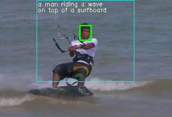

# Instance Captioning

This demo project was implemented by [KCFcpp-py-wrapper](https://github.com/uoip/KCFcpp-py-wrapper) + [NeuralTalk2](https://github.com/karpathy/neuraltalk2) + [Lutorpy](https://github.com/imodpasteur/lutorpy). Also need OpenCV and its python wrapper.

## Usage
1. Download NeuralTalk2's pretrained model. This demo use CPU based moel; you can download it from [here](http://cs.stanford.edu/people/karpathy/neuraltalk2/checkpoint_v1_cpu.zip).
2. Prepare OTB100 dataset for evaluation
2. Modify change the load path for load_model() in line 68 of demo.py to correctly load the pretrained model.
3. Run
~~~
   python2 demo.py YOUT_OTB100_ROOT_DIR/TEST_CASE_ROOT_DIR
~~~
   to see the result, for example:
~~~
   python2 demo.py ./data/Walking
~~~
   
If you don't have OTB100 dataset, you can modify the source code to adapt to other dataset, and even video captured by webcam. Some code in [KCFcpp-py-wrapper/run.py](https://github.com/uoip/KCFcpp-py-wrapper/blob/master/run.py) may be useful.

If you have powerfull CPU or GPU, you can try smooth version of this demo:
~~~
   python2 demo_smooth.py YOUT_OTB100_ROOT_DIR/TEST_CASE_ROOT_DIR
~~~
for example:
~~~
   python2 demo_smooth.py ./data/Walking
~~~

## Glimpse
 
 
 