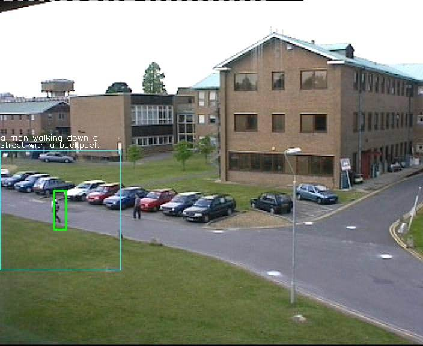

# Instance Captioning

This demo project was implemented by [KCF](https://github.com/uoip/KCFcpp-py-wrapper) + [NeuralTalk2](https://github.com/karpathy/neuraltalk2) + [Lutorpy](https://github.com/imodpasteur/lutorpy)

 
 